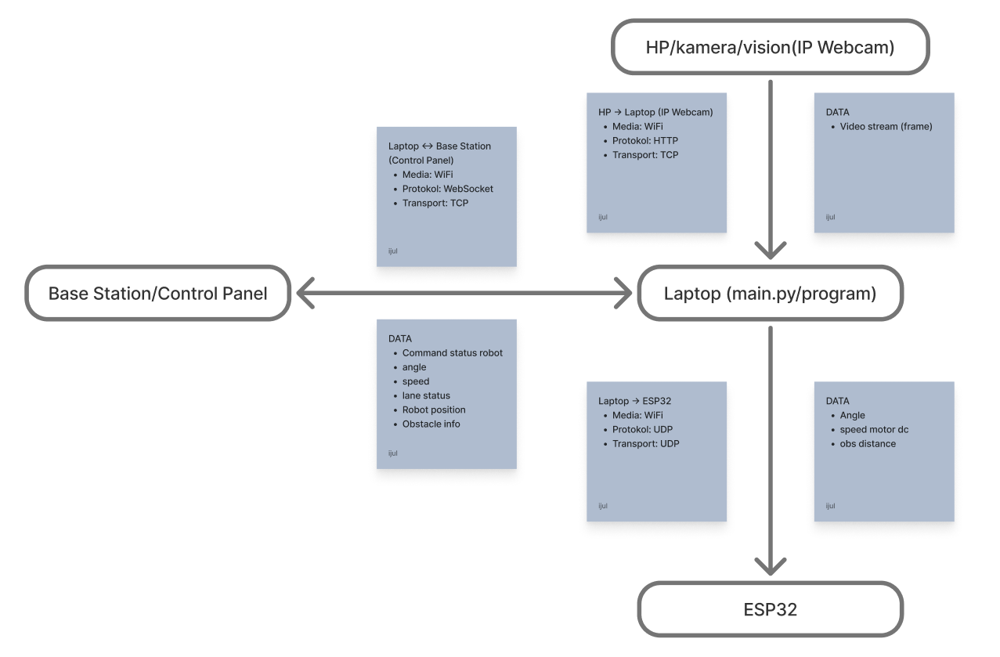

# Ijul IRIS CUP Archive

bismillah aja dulu

<h2>FLOW PROGRAM (kasar)</h2>

HP(IP WEBCAM) --(WIFI/TCP)--> Laptop(main control program) --(WIFI/TCP)--> ESP32 --(selanjutnya urusan electrical)

<h3>Detail</h3>
<h4>HP(IP WEBCAM)</h4>

<ul>Ngambil stream(raw) untuk di proses main program</ul>
<ul>Dihubungkan wireless ke laptop lewat WIFI(hostpot lebih aman)</ul>

<h4>LAPTOP</h4>

<ul>Main control robot</ul>
<ul>Aku pake piton</ul>
<ul>Base Station aku edit dikit dari Base Station FP1</ul>
<ul>Tampilan data yang sudah ada sebelumnya: 
-Speed 
-Jarak tempuh (mungkin aku hapus) 
-Steering Angle 
-Lane Detector 
-Obstacle </ul>
<ul>Target data yang ingin aku tambahkan: 
-Tombol start untuk menjalankan robotnya 
-Tombol stop untuk memberhentikan robot (ulang dari awal) 
-Lane Robot Position Detector(robot ada di jalur kanan atau kiri) </ul>

<h4>ESP32</h4>

<ul>cuman buat ngehubungin laptop ke ESP32 pakai WIFI</ul>

<h2>PROGRAM EXPLAIN: ALL FLOW</h2>
<pre>
Operator (Base Station)
        │  WebSocket
        ▼
  main.py  ─────────────► vision.py
    │                          │
    │                          ▼
    │                    Hasil vision
    │                          │
    ├──────────────► control.py
    │                    │
    │                    ▼
    │               Steering + Speed
    │
    │ UDP
    ▼
 communication.py ─────────► ESP32 (robot)
        ▲                         │
        │   Data sensor (UDP)     │
        └─────────────────────────┘

Data sensor → main.py → Base Station (update realtime)
</pre>

<h4>Partisi file</h4>
<pre>
mainControl/
├── basestation/
│   ├── app.js
│   ├── index.html
│   ├── logo.png
│   └── styles.css
├── communication.py
├── control.py
├── main.py
├── requirements.txt
└── vision.py
</pre>

<h3>Base Station (Web UI)</h3>

Folder: <code>basestation/</code> 
Berisi <code>index.html</code>, <code>app.js</code>, dan <code>styles.css</code>.  
UI ini digunakan operator untuk mengontrol robot.

<ul>
  <li>Mengirim perintah: <em>start</em>, <em>stop</em>, <em>manual/auto</em>, <em>target speed</em>.</li>
  <li>Menerima telemetri dari robot: sudut, speed, status lane, obstacle info.</li>
  <li>Berkomunikasi dengan <code>main.py</code> menggunakan WebSocket.</li>
</ul>

<h3>main.py (Program Utama)</h3>

File inti yang menjalankan seluruh logika sistem.  
Tugas utamanya:

<ul>
  <li>Menerima input perintah dari Base Station.</li>
  <li>Mengambil video stream dari kamera HP / IP Webcam.</li>
  <li>Memanggil modul <code>vision.py</code> untuk analisis gambar.</li>
  <li>Memanggil <code>control.py</code> untuk perhitungan kendali.</li>
  <li>Mengirimkan hasil kendali ke <code>communication.py</code> supaya diteruskan ke ESP32.</li>
  <li>Meneruskan data sensor dari ESP32 kembali ke Base Station.</li>
</ul>

<code>main.py</code> adalah pusat alur: menerima data, memproses, mengirim balikan ke UI.

<h3>vision.py (Pemrosesan Kamera)</h3>

Modul ini bertanggung jawab untuk seluruh proses komputer visi:

<ul>
  <li>Mengambil frame dari IP Webcam (HTTP/TCP).</li>
  <li>Mendeteksi garis (lane detection).</li>
  <li>Memberikan nilai <code>angle_deg</code> untuk dikirim ke kontrol.</li>
  <li>Mendeteksi obstacle menggunakan metode visual (jika ada).</li>
</ul>

Output utama ke <code>main.py</code>:

<pre>
{
  "angle": ...,
  "lane_status": ...,
  "debug_frame": ...,
  "obstacle_info": { ... }
}
</pre>

<h3>control.py (Kendali Robot)</h3>

Modul ini mengatur logika pengendalian gerak robot berdasarkan hasil vision:

<ul>
  <li>Penerapan PID untuk smoothing dan feedback sudut.</li>
  <li>Penentuan kecepatan berdasarkan besarnya steering.</li>
  <li>Mode normal → hindar obstacle → kembali ke jalur.</li>
</ul>

Output ke <code>main.py</code>:

<pre>
{
  "steer": ...,
  "speed": ...
}
</pre>

File ini memastikan robot bergerak stabil dan aman.

<h3>communication.py (Pengiriman & Penerimaan Data)</h3>

Modul yang menangani komunikasi jaringan:

<ul>
  <li><strong>WebSocket (TCP)</strong> untuk komunikasi dengan Base Station.</li>
  <li><strong>UDP</strong> untuk mengirim perintah motor ke ESP32.</li>
  <li>Menerima balikan sensor obstacle dari ESP32.</li>
</ul>

Data dari control.py dikirim ke ESP32 dalam format:

<pre>
"angle=<value>;speed=<value>"
</pre>

Balikan dari ESP32:

<pre>
"obs_distance=<value>"
</pre>

<h3>ESP32 (Robot)</h3>

<ul>
  <li>Menerima perintah <code>angle</code> dan <code>speed</code> via UDP</li>
  <li>Mengatur motor DC melalui PWM</li>
  <li>Mengirim data jarak obstacle ke laptop</li>
</ul>

ESP32 (ujung output) kirim data untuk menjalankan robot

<h2>PROGRAM EXPLAIN: COMMUNICATION</h2>
</img>
<h3>HP / Kamera (IP Webcam) → Laptop</h3>
<ul>
  <li>Media: <b>WiFi</b></li>
  <li>Protocol: <b>HTTP Stream / MJPEG</b></li>
  <li>Transport: <b>TCP</b></li>
  <li>Data yang dikirim: <b>Video stream (frame)</b> untuk proses vision.</li>
</ul>

<h3>Laptop (main.py)</h3>

Menjadi pusat pemrosesan seluruh data dan komando.

<h4>Laptop → ESP32</h4>
<ul>
  <li>Media: <b>WiFi</b></li>
  <li>Protocol: <b>UDP</b></li>
  <li>Transport: <b>UDP</b></li>
  <li>Data dikirim:
    <ul>
      <li>Steering angle</li>
      <li>Motor speed (PWM)</li>
    </ul>
  </li>
</ul>

<h4>ESP32 → Laptop</h4>
<ul>
  <li>Protocol: <b>UDP</b></li>
  <li>Transport: <b>UDP</b></li>
  <li>Data dikirim: <b>Obstacle distance</b></li>
</ul>

<h4>Laptop ↔ Base Station / Control Panel</h4>
<ul>
  <li>Media: <b>WiFi</b></li>
  <li>Protocol: <b>WebSocket</b></li>
  <li>Transport: <b>TCP</b></li>
  <li>Data yang dikirim ke Base Station:
    <ul>
      <li>Angle</li>
      <li>Speed</li>
      <li>Lane status</li>
      <li>Robot position</li>
      <li>Obstacle info</li>
      <li>Status perintah robot</li>
    </ul>
  </li>
</ul>

<h3>ESP32</h3>
<ul>
  <li>Menerima perintah <b>angle + PWM speed</b> dari Laptop.</li>
  <li>Mengirim balik <b>jarak obstacle</b>.</li>
  <li>Menjalankan aktuator (motor DC + steering servo).</li>
</ul>

<h2>PROGRAM EXPLAIN: CONFIGURATION CONTROL</h2>
<!-- </img> -->
<h3>Input Kendali</h3>
<ul>
  <li><b>Lane Angle</b> -> dihitung dari hasil BEV + Hough transform</li>
  <li><b>Lane Status</b> -> Detected / Lost</li>
  <li><b>Robot Position</b> -> left / center / right</li>
  <li><b>Obstacle Distance</b> -> dikirim dari ESP32 via UDP</li>
</ul>

<h3>Decision Making (RobotController)</h3>

Robot menggunakan finite-state logic:

<ul>
  <li><b>normal</b> — mengikuti marka jalan (PID steering)</li>
  <li><b>avoid</b> — obstacle dekat → belok kanan</li>
  <li><b>return_left</b> — setelah obstacle hilang → kembali ke jalur</li>
</ul>

<h3>Output Kendali</h3>
<ul>
  <li><b>Steering Angle</b> (−45° sampai +45°)</li>
  <li><b>Speed PWM</b>, ditentukan dari kurva:
    <ul>
      <li>Sisi belok besar → PWM rendah</li>
      <li>Jalan lurus → PWM tinggi</li>
    </ul>
  </li>
</ul>

<h3>Pengiriman ke ESP32</h3>
<ul>
  <li>Media: <b>WiFi</b></li>
  <li>Protocol: <b>UDP</b></li>
  <li>Data Format: <code>steer,speed\n</code></li>
</ul>

<h3>Peran ESP32</h3>
<ul>
  <li>Menerapkan PWM ke motor DC</li>
  <li>Menggerakkan servo steering</li>
  <li>Mengirim data <b>distance (cm)</b> kembali ke Laptop</li>
</ul>

<h3>Telemetry</h3>

Semua data kendali (angle, speed, status, obstacle) dikirim ke Base Station melalui WebSocket (TCP).

<h2>ISI HATI IJUL</h2>

Mff mas mesoh, ini definisi menikmati proses

<h3>7 November 2025</h3>

Jujur masih bingung kira-kira gimana ya hubungin program ke robotnya, takut jalan aja gx bisa njir &#128128

<h3>8 November 2025</h3>

Coba cicil control panel a.k.a BS dulu deh, jujur agak takut

<h3>9 November 2025</h3>

Tampilan udah oke, tp ngiseng e iki connection bs ku kok bosok yo

Mechanical baru eksekusi robotnya skrng, aku no info electric gmn, gx pernah reach out klo bkn aku yang chat duluan

disini aku solve sesuatu dan menambah error baru, solve sesuatu dan menambah error baru lagi

aku wes dapat informasi jobdesk aKu gmn

<h3>10 November 2025</h3>

Mulai fix bs

<h3>11 November 2025</h3>

Masih ada kendala buat ngonekin bs

<h3>12 November 2025</h3>

wah bisa jir, tp ini data framenya bermasalah

<h3>13 November 2025</h3>

alhamdulillah programku progress lah

ROBOT E DRG JADI

<h3>14 November 2025</h3>

okelah dl ditambah 2 hari, semoga fisik robotku selesai

<h3>15 November 2025</h3>

blm jadi

<h3>16 November 2025</h3>

blm jadi robotnya

<h3>17 November 2025</h3>

0 testing, hehe
